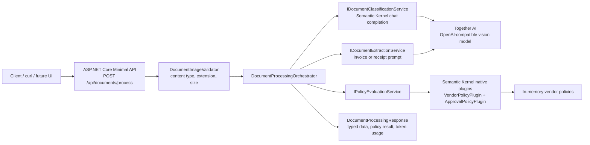

# C# Semantic Document Processor

.NET 8 Web API portfolio project that classifies document images, extracts typed invoice or receipt data, and applies deterministic business policy checks through Microsoft Semantic Kernel.

The business scenario is a lightweight accounts-payable intake workflow: receive a synthetic invoice or receipt image, classify it, extract only the fields needed by downstream systems, match vendors against an approved list, and return an auditable policy decision with token usage for cost tracking.

The target architecture is Microsoft-centric at the application layer:

- ASP.NET Core Minimal API
- dependency injection
- options binding with `IOptions<T>`
- Microsoft Semantic Kernel
- provider-portable LLM configuration through an OpenAI-compatible endpoint

The initial provider target is Together AI using a configurable vision-capable open model.

## Current Status

Milestones 1-9 are in place:

- solution file
- Web API project
- pinned Semantic Kernel connector package
- `AiSettings` options model
- environment-based API key provider
- lazy Semantic Kernel registration
- `/health` endpoint
- initial domain model for invoices, receipts, shared document metadata, and policy decisions
- image intake endpoint with multipart validation and file metadata response
- live image classification through Semantic Kernel and Together AI
- typed invoice and receipt extraction through Semantic Kernel and Together AI
- deterministic Semantic Kernel native plugins for vendor matching and policy evaluation
- `DocumentProcessingOrchestrator` for classify, route, extract, evaluate, and aggregate response flow
- xUnit tests for deterministic policy, validation, parsing, and orchestration paths
- synthetic demo assets for the current invoice and receipt scope

Policy evaluation is implemented for the v1 invoice and receipt samples. The API endpoint handles upload validation and delegates the semantic workflow to the orchestrator.

## Architecture



The application keeps the model-facing behavior behind app-owned service interfaces. Semantic Kernel is used for the chat-completion integration and the native C# business plugins, while the approval decisions themselves stay deterministic and testable.

## Microsoft / Semantic Kernel Vocabulary

| Concept | In this project | Microsoft-centric vocabulary |
| --- | --- | --- |
| API host | `SemanticDocumentProcessor.Api` | ASP.NET Core Minimal API |
| Configuration | `AiSettings`, `DocumentIntakeSettings`, `PolicySettings` | Options pattern with `IOptions<T>` |
| Model connector | `AddOpenAIChatCompletion` with a custom endpoint | Semantic Kernel chat completion service |
| Workflow coordinator | `DocumentProcessingOrchestrator` | Application service / orchestration layer |
| Model prompt boundary | classification and extraction services | Semantic Kernel chat history plus prompt execution settings |
| Business functions | `VendorPolicyPlugin`, `ApprovalPolicyPlugin` | Semantic Kernel native plugins / kernel functions |
| Typed outputs | `InvoiceData`, `ReceiptData`, `ProcessedDocument` | C# records with predictable JSON serialization |
| Policy output | `InvoicePolicyResult`, `ReceiptPolicyResult` | deterministic domain service result |
| Cost signal | `ModelTokenUsage`, `DocumentModelUsage` | structured logging and response telemetry |

## Configuration

Default AI settings live in `src/SemanticDocumentProcessor.Api/appsettings.json`:

```json
{
  "Ai": {
    "Provider": "TogetherAI",
    "Endpoint": "https://api.together.xyz/v1",
    "ModelId": "google/gemma-4-31B-it",
    "ApiKeyEnvironmentVariable": "TOGETHER_API_KEY",
    "ServiceId": "together-vision",
    "RequestTimeoutSeconds": 180
  }
}
```

Do not put API keys in source-controlled configuration files.

Set the Together key as a user-level environment variable:

```powershell
[Environment]::SetEnvironmentVariable("TOGETHER_API_KEY", "your_key_here", "User")
```

Restart the terminal or Codex session after setting the variable.

For a one-session smoke test:

```powershell
$env:TOGETHER_API_KEY = "your_key_here"
```

## Run

```powershell
dotnet run --project .\src\SemanticDocumentProcessor.Api\SemanticDocumentProcessor.Api.csproj
```

Health check:

```http
GET http://localhost:5275/health
```

The health response reports whether the configured API key environment variable is present, without exposing the key.

Process an image:

```powershell
curl.exe -F "image=@assets/sample-doc1.png;type=image/png" -F "sourceId=sample-doc1" http://localhost:5275/api/documents/process
```

Try all included demo assets:

```powershell
curl.exe -F "image=@assets/sample-doc1.png;type=image/png" -F "sourceId=sample-doc1" http://localhost:5275/api/documents/process
curl.exe -F "image=@assets/sample-doc2.png;type=image/png" -F "sourceId=sample-doc2" http://localhost:5275/api/documents/process
curl.exe -F "image=@assets/sample-doc3.png;type=image/png" -F "sourceId=sample-doc3" http://localhost:5275/api/documents/process
```

The current processing endpoint validates and reads the uploaded image, then delegates to `DocumentProcessingOrchestrator`. The orchestrator classifies it as `Invoice`, `Receipt`, or `Unknown`, routes to the correct extractor, evaluates deterministic C# business policy through Semantic Kernel native plugins where applicable, and returns a single typed response.

Responses include `modelUsage` with token counts for each model call and per-document totals when the provider returns usage data:

```json
{
  "modelUsage": {
    "calls": [
      {
        "operation": "classification",
        "modelId": "google/gemma-4-31B-it",
        "inputTokens": 439,
        "outputTokens": 150,
        "totalTokens": 589
      }
    ],
    "totalInputTokens": 439,
    "totalOutputTokens": 150,
    "totalTokens": 589
  }
}
```

The API also emits structured log events named `ModelTokenUsage` and `DocumentModelUsage` with `FileName`, `SourceId`, `ModelId`, and token fields for downstream cost analysis.

The included sample assets currently process as:

- `assets/sample-doc1.png`: `Invoice`, vendor `Workspace Interiors Ltd`, total `967.20 GBP`
- `assets/sample-doc2.png`: `Receipt`, store `Meadow Vale Supermarket`, total `21.02 GBP`
- `assets/sample-doc3.png`: `Receipt`, store `South Coast Rail Services`, total `32.30 GBP`

All current samples evaluate to `Approved` under the seeded policies. Invoice policy checks vendor alias matching, active vendor status, currency, and max auto-approved value. Receipt policy checks the review threshold and visible payment method.

## Provider Portability

The code is intentionally not tied to a direct OpenAI account. The current configuration uses Together AI through an OpenAI-compatible endpoint because Semantic Kernel can speak to that shape via `AddOpenAIChatCompletion`.

Provider-specific details are concentrated in configuration:

- `Ai:Provider`
- `Ai:Endpoint`
- `Ai:ModelId`
- `Ai:ApiKeyEnvironmentVariable`
- `Ai:ServiceId`
- `Ai:RequestTimeoutSeconds`

The rest of the application depends on `IDocumentClassificationService`, `IDocumentExtractionService`, `IPolicyEvaluationService`, and `IDocumentProcessingOrchestrator`. A later provider profile can swap endpoint/model/key settings when the provider supports the same chat-completion/image payload shape. If a provider needs a different payload contract, the change should stay behind the classification and extraction service interfaces, leaving the API contract, domain records, and policy plugins intact.

## PDF Scope

PDF input is deliberately out of scope for v1. The portfolio point here is the semantic processing workflow, not document rasterization. Keeping the public endpoint image-only avoids mixing two concerns:

- image intake, classification, extraction, and policy evaluation
- PDF page rendering, page selection, and multi-page document handling

PDF support can be added later as an adapter in front of the existing pipeline:

1. Accept a PDF upload through a separate intake path.
2. Render selected pages to images using a PDF-to-image library or service.
3. Submit each rendered image to the existing `DocumentProcessingOrchestrator`.
4. Add aggregation rules for multi-page documents if needed.

That keeps the current model prompts, typed extraction records, policy plugins, and response model reusable.

## Portfolio Narrative

This project demonstrates a pragmatic enterprise AI pattern for C# teams: use Microsoft-native application structure and Semantic Kernel integration points while keeping the LLM provider replaceable. The model handles fuzzy visual understanding and field extraction; C# owns validation, routing, vendor policy, approval thresholds, logging, and tests.

The result is a small but realistic document-processing slice: it shows how to add AI into a .NET workflow without handing core business decisions to the model, and it produces typed, auditable responses that a finance or operations system could consume.

Policy verification without live model calls:

```powershell
dotnet run --project .\spikes\PolicyPluginVerifier\PolicyPluginVerifier.csproj --no-restore
```

The verifier invokes the Semantic Kernel native policy plugins directly with the current sample extraction values.

## Tests

Run the unit test suite:

```powershell
dotnet test .\tests\SemanticDocumentProcessor.Tests\SemanticDocumentProcessor.Tests.csproj --no-restore
```

The tests cover deterministic vendor matching, approval policy boundaries, upload image validation, model JSON parsing failure paths, and orchestrator routing using fake classifier/extractor/policy services. The test project is run by project path so the existing solution build remains focused on the API project.
